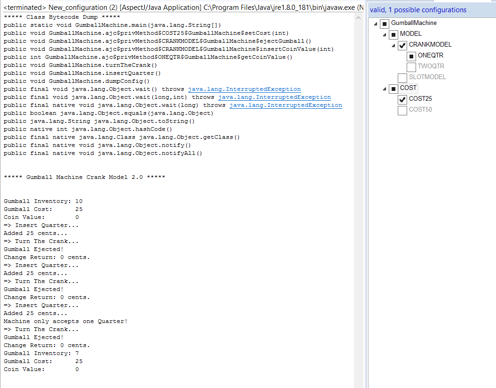
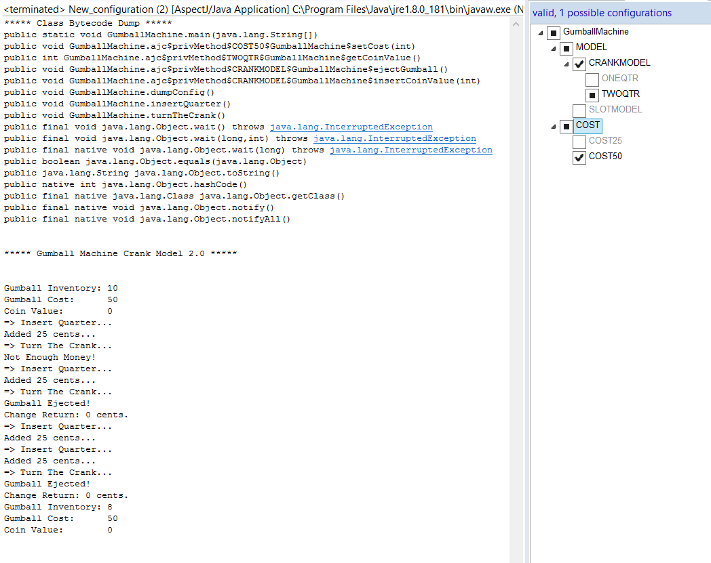
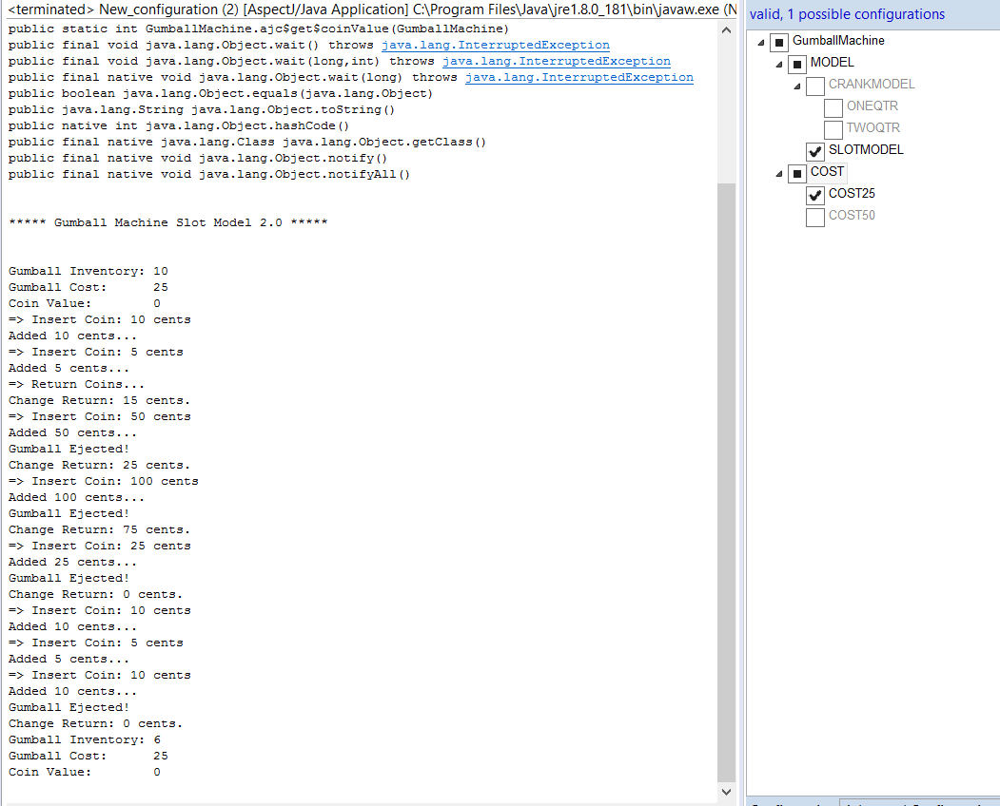
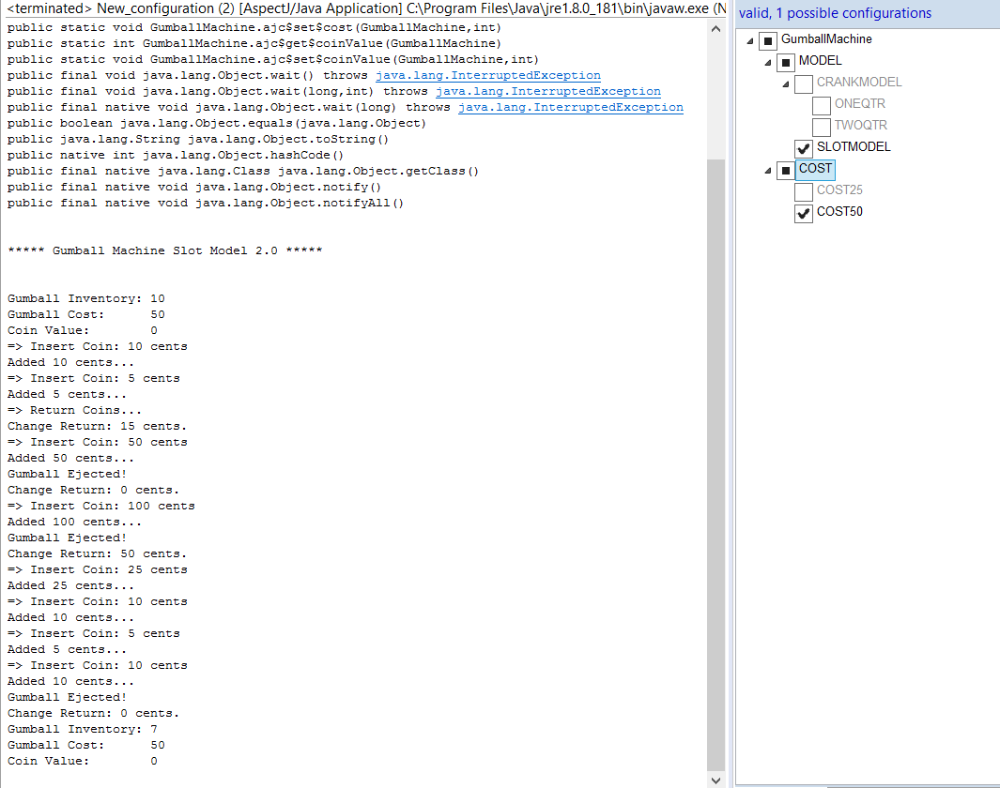

## Submission for CMPE202 Lab 10

### Summary

- Lab1 was implemented by creating a derived class for each type of gumball machine. Whereas with AspectJ, we need to implement a single machine with different configurations. These configurations can be changed easily to achieve desired output. The overall code for implementing the gumball machine has also reduces due to AspectJ.

### Lab 10 Screenshots-

- Solution source code has been included in the folder 'lab10_src'

- Configurations and outputs:

i. Model: CRANK , COST: 25

ii. Model: CRANK , COST: 50

iii. Model: SLOT , COST: 25

iv. Model: SLOT , COST: 50

